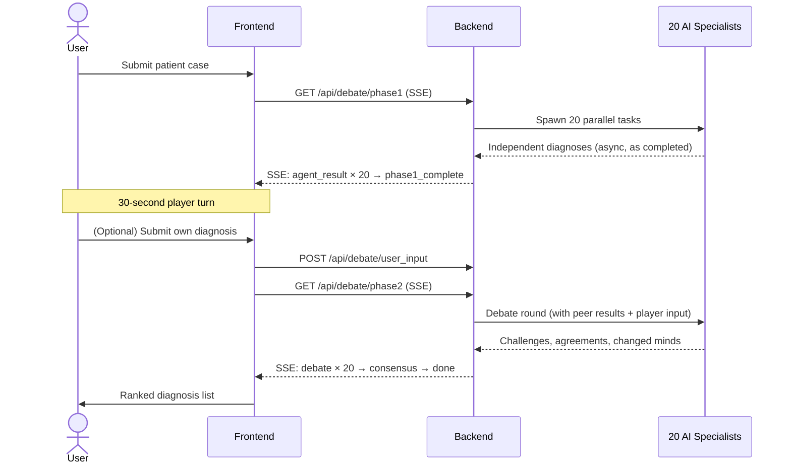
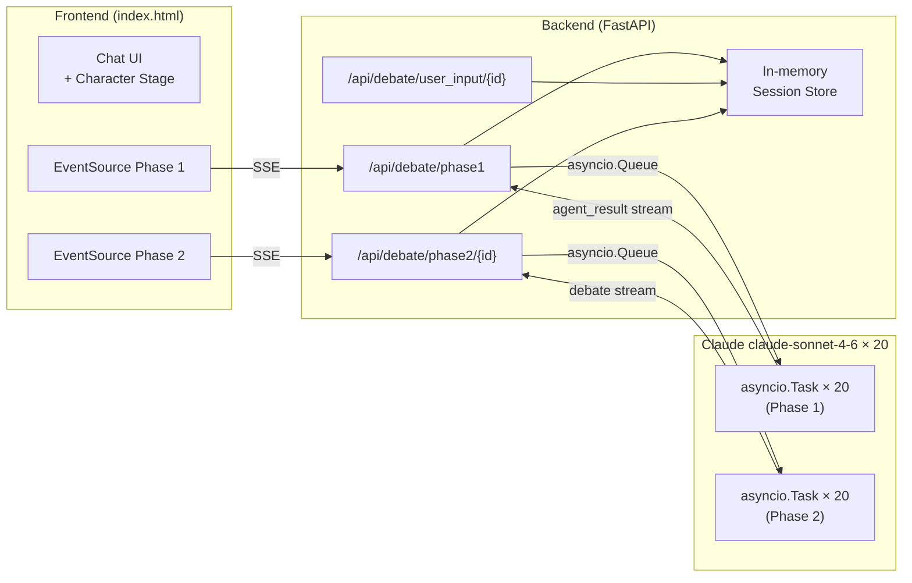

# MedDebate

> 20 AI medical specialists debate your patient case in real time — then vote on a consensus diagnosis.

**Install as an OpenClaw skill:**
```bash
clawhub install meddebate
```

---

## How it works



---

## Specialist roster

```mermaid
graph TD
    Case["Patient Case"] --> P1["Phase 1: Independent Reasoning"]

    P1 --> T["👩‍⚕️ Alex — Triage"]
    P1 --> IM["🧑🏿‍⚕️ Dr. Okafor — Internal Med"]
    P1 --> C["👨‍⚕️ Dr. Webb — Cardiology"]
    P1 --> N["👩🏽‍⚕️ Dr. Kapoor — Neurology"]
    P1 --> ID["👨🏿‍⚕️ Dr. Nkosi — Infect. Disease"]
    P1 --> R["👩🏻‍⚕️ Dr. Vasquez — Rheumatology"]
    P1 --> E["👨🏻‍⚕️ Dr. Park — Endocrinology"]
    P1 --> O["👩🏾‍⚕️ Dr. Brennan — Oncology"]
    P1 --> PL["👨🏽‍⚕️ Dr. Reyes — Pulmonology"]
    P1 --> G["👩🏽‍⚕️ Dr. Ahmad — Gastroenterology"]
    P1 --> H["👨🏼‍⚕️ Dr. Johansson — Hematology"]
    P1 --> NP["👩🏾‍⚕️ Dr. Al-Rashid — Nephrology"]
    P1 --> RD["👨🏻‍⚕️ Dr. Wei — Radiology"]
    P1 --> PA["👩🏻‍⚕️ Dr. Tanaka — Pathology"]
    P1 --> D["🧑🏿‍⚕️ Dr. Mensah — Dermatology"]
    P1 --> PS["👩🏼‍⚕️ Dr. Goldstein — Psychiatry"]
    P1 --> IM2["👨🏽‍⚕️ Dr. Di Luca — Immunology"]
    P1 --> GE["👩🏾‍⚕️ Dr. Diallo — Genetics"]
    P1 --> ER["👩🏼‍⚕️ Dr. Sorensen — ER"]
    P1 --> HO["🧙‍♂️ Dr. House — Senior Diagnostician"]

    T & IM & C & N & ID & R & E & O & PL & G & H & NP & RD & PA & D & PS & IM2 & GE & ER & HO --> P2["Phase 2: Debate & Challenge"]
    P2 --> CON["Consensus Vote"]
```



---

## Demo output

```
═══════════════════════════════════════════════════════════════════
  MEDDEBATE  |  20 AI Specialists Analyzing Case
═══════════════════════════════════════════════════════════════════

PHASE 1: Independent Reasoning

  👩‍⚕️  Alex Chen                [Triage Nurse          ]  → Systemic autoimmune disease          82%
  🧑🏿‍⚕️  Dr. Sarah Okafor         [Internal Medicine     ]  → Systemic Lupus Erythematosus         87%
  👨‍⚕️  Dr. Marcus Webb          [Cardiologist          ]  → Libman-Sacks endocarditis             41%
  👩🏽‍⚕️  Dr. Priya Kapoor         [Neurologist           ]  → Neuropsychiatric lupus                76%
  👩🏻‍⚕️  Dr. Elena Vasquez        [Rheumatologist        ]  → Systemic Lupus Erythematosus          94%
  🧙‍♂️  Dr. House               [Senior Diagnostician  ]  → SLE with lupus nephritis               91%
  ...

PHASE 2: Debate & Challenge

  ⚔️  Dr. House challenges Dr. Webb:
      "Libman-Sacks doesn't explain RBC casts + dsDNA positive.
       This is lupus nephritis. Cardiology is missing the forest for the trees."
  🔄 Dr. Webb CHANGED MIND → Systemic Lupus Erythematosus
  ✓  Dr. Kapoor agrees with Dr. Okafor

═══════════════════════════════════════════════════════════════════
CONSENSUS DIAGNOSIS
═══════════════════════════════════════════════════════════════════
  1. Systemic Lupus Erythematosus       ████████░░  84%  (14 votes)
  2. Neuropsychiatric SLE               █████░░░░░  71%   (4 votes)
  3. Drug-induced Lupus                 ███░░░░░░░  52%   (2 votes)
```

---

## Architecture



---

## Setup

### OpenClaw skill (recommended)

```bash
clawhub install meddebate
```

Then in any OpenClaw channel (Slack, WhatsApp, Telegram, Discord):

```
/meddebate Patient: [your case]
/meddebate demo:lupus
/meddebate demo:wilson
/meddebate demo:lyme
/meddebate demo:lead
```

### Web demo (local)

```bash
git clone https://github.com/yourusername/meddebate
cd meddebate

pip install -r requirements.txt
cp .env.example .env
# Edit .env and add your ANTHROPIC_API_KEY

cd web
python3 -m uvicorn backend:app --reload --port 8000
# Open http://localhost:8000
```

### CLI

```bash
python3 scripts/debate_engine.py --demo lupus
python3 scripts/debate_engine.py --case "Patient: 45M, hemoptysis, weight loss, 30 pack-year smoker..."
```

---

## Tech stack

| Layer | Technology |
|-------|-----------|
| AI agents | Claude claude-sonnet-4-6 via Anthropic API |
| Parallelism | Python asyncio + asyncio.Queue |
| Backend | FastAPI + Server-Sent Events (SSE) |
| Frontend | Vanilla JS + Tailwind CDN, single HTML file |
| Distribution | OpenClaw skill (SKILL.md + ClawHub) |

---

## Project structure

```
meddebate/
├── SKILL.md               # OpenClaw skill manifest
├── README.md
├── requirements.txt
├── .env.example
├── scripts/
│   ├── __init__.py
│   ├── specialists.py     # 20 specialist definitions
│   ├── demo_cases.py      # Pre-built mystery cases
│   └── debate_engine.py   # CLI orchestrator
└── web/
    ├── backend.py          # FastAPI + SSE server
    └── index.html          # Single-file frontend
```

---

> **Disclaimer:** MedDebate is for educational and demonstration purposes only. It is not a substitute for professional medical advice. Always consult qualified healthcare professionals for clinical decisions.
